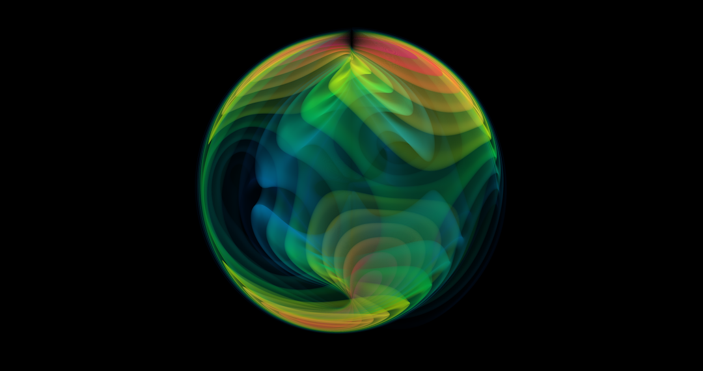

# gwpv

This Python package uses the [ParaView](https://www.paraview.org) scientific
visualization toolkit to produce 3D renderings of gravitational-wave data from a
numerical simulation or a waveform model.

```{toctree}
:hidden:

self
gallery
```

```{toctree}
:hidden:
:caption: Documentation

installation
usage
gui
```
